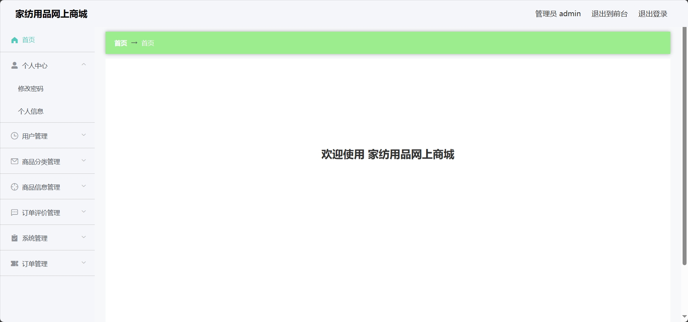
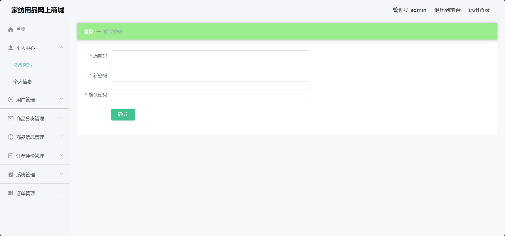
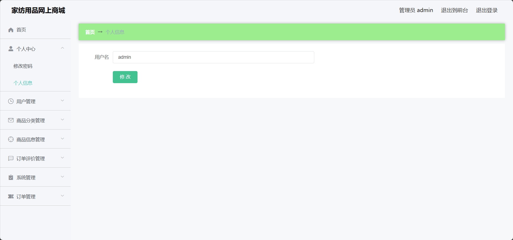
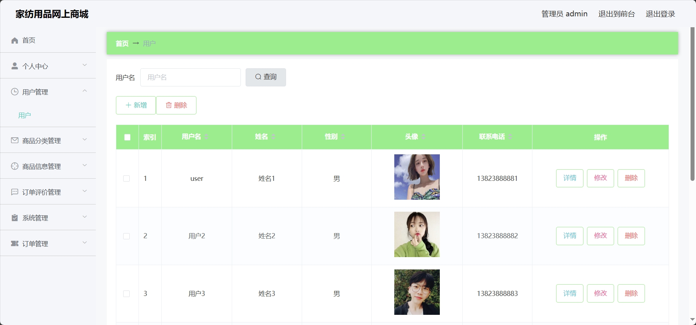
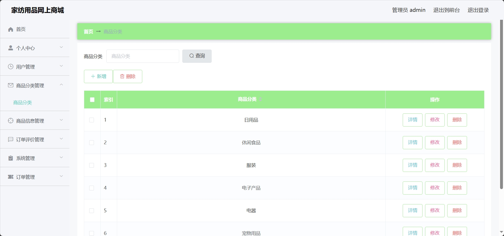
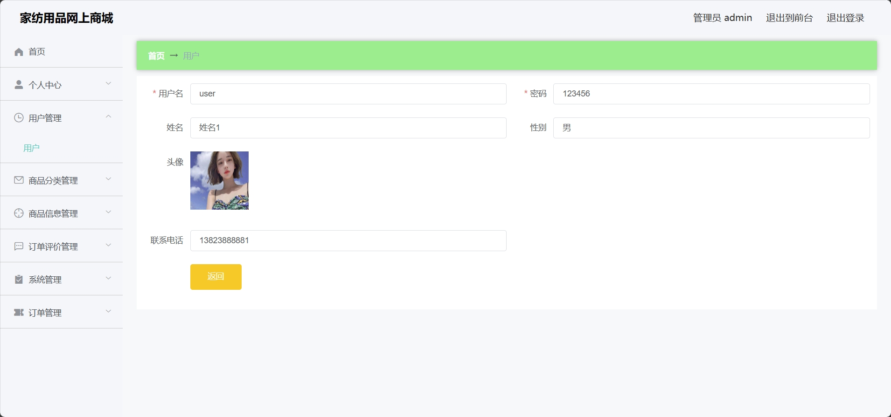

<h1 align="center">基于SSM的家纺用品网上商城购物系统</h1>

<h4> 完整代码获取地址：从戎源码网（https://armycodes.com/） </h4>
<h4> 作者微信：19941326836 QQ：605739993 QQ群：655392706 </h4>
<h4> 承接计算机毕设、Java毕业设计、Python毕业设计、深度学习、机器学习 </h4>
<h4> 选题+开题报告+任务书+程序定制+安装调试+论文+答辩ppt 一条龙服务 </h4>
<h4> 毕业设计所有选题地址：(https://github.com/Descartes007/allProject) </h4>

## 一、项目介绍

基于SSM的家纺用品网上商城购物系统：前端 html、jquery、layui，后端 maven、springmvc、spring、mybatis；角色分为管理员、用户；集成商品购买、商品资讯、订单查询等功能于一体的系统。

### 1、管理员：

- 基本操作：登录、修改个人信息、上传图片、获取个人信息、获取消息列表、回复消息
- 用户信息管理：获取用户列表、筛选用户信息、查看用户详情、修改用户信息、删除用户信息、添加用户
- 图书信息管理：获取图书列表、筛选图书信息、查看图书详情、修改图书信息、删除图书信息、新增图书、查看图书评论、回复评论、删除评论
- 图书类别管理：获取类别列表、筛选类别信息、修改类别信息、删除类别信息、新增类别
- 热门排行管理：获取热门列表、筛选热门信息、查看热门详情、修改热门信息、删除热门信息、添加热门、查看热门评论、回复评论、删除评论
- 管理员管理：获取管理员列表、筛选管理员信息、查看管理员详情、修改管理员信息、删除管理员信息、添加管理员
- 系统信息管理：获取咨询列表、筛选咨询信息、查看咨询详情、修改咨询信息、删除咨询信息、添加咨询、获取轮播图列表、筛选轮播图信息、查看轮播图详情、修改轮播图信息、删除轮播图信息、添加轮播图
- 订单信息管理：获取订单列表、筛选订单信息、查看订单详情、修改订单信息、删除订单信息、添加订单

### 2、用户：

- 基本操作：登录、修改个人信息、上传图片、获取个人信息、余额充值、注册用户、获取轮播图列表、在线客服
- 商品管理：获取商品列表、查看商品详情、筛选商品、收藏商品、添加购物车、立即购买、商品评价、筛选收藏
- 咨询管理：获取咨询列表、查看咨询详情
- 订单管理：获取订单列表、确认收货、取消订单、订单支付
- 地址管理：添加地址、删除地址、修改地址、获取地址列表
- 购物车管理：删除商品、增减数量、购买商品

## 二、环境

- <b>IntelliJ IDEA 2020.3</b>

- <b>Mysql 5.7.26</b>

- <b>Tomcat 9.0.41</b>

- <b>NodeJs 14.17.3</b>

- <b>Maven 3.6.3</b>

- <b>JDK 1.8</b>

## 三、运行截图

